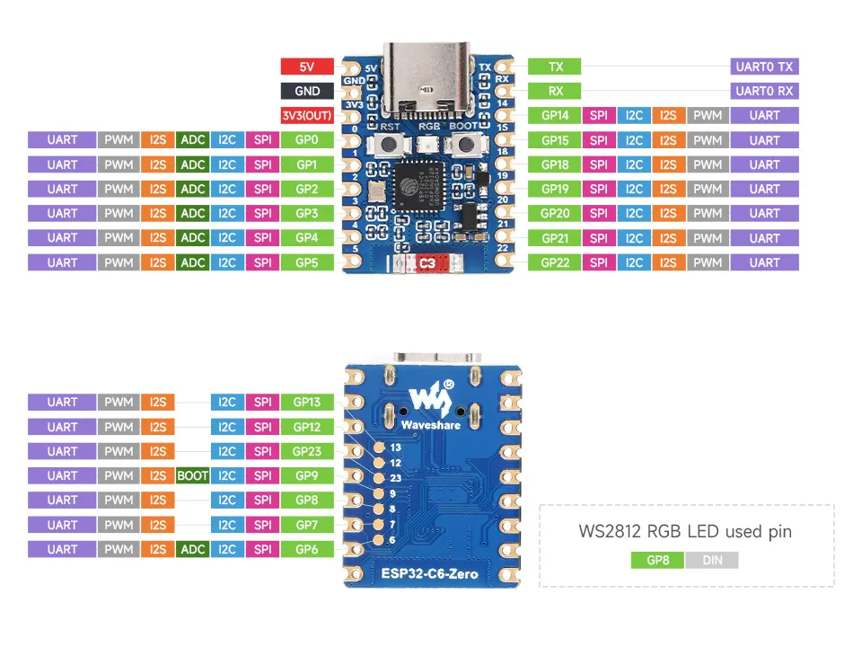

# Hardware

Waveshare **ESP32-C6-Zero** (native USB-C) wired to an **E07-M1101D (CC1101, 433 MHz)** radio. The E07 runs at **3.3 V — never 5 V**.

The E07 pins are a 2×4 header (odd pins on the bottom row, even on the top):

```
top row     2 VCC     4 CSN     6 MOSI    8 GDO2
bottom row  1 GND     3 GDO0    5 SCK     7 MISO/GDO1
```

| E07 row | E07 pin        | Signal          | ESP32-C6-Zero |
|---------|----------------|-----------------|---------------|
| bottom  | 1 · GND        | Ground          | GND           |
| bottom  | 3 · GDO0       | TX data out     | GP22          |
| bottom  | 5 · SCK        | SPI clock       | GP19          |
| bottom  | 7 · MISO/GDO1  | SPI data out    | GP20          |
| top     | 2 · VCC        | 3.3 V power     | 3V3(OUT)      |
| top     | 4 · CSN        | SPI chip select | GP21          |
| top     | 6 · MOSI       | SPI data in     | GP4           |
| top     | 8 · GDO2       | RX data out     | GP5           |



Both GDO lines are wired: **GDO0 (GP22) transmits** and **GDO2 (GP5) receives** — receive is what lets the board hear your existing remotes for discovery and keep rolling codes in sync. Attach a 433 MHz antenna to the E07. `MOSI (GP4)` and `GDO2 (GP5)` sit on the **left** header, the rest on the top-right — GP4/GP5 are the external-JTAG pins but the console runs over the internal USB-Serial-JTAG, so they're free (and, unlike GP23, actually broken out to a header rather than a back-side pad). The remaining GPIOs are avoided on purpose (GP12/13 native USB, GP8/9/15 strapping/flash, GP14 on-board RF antenna switch).

Default carrier 433.42 MHz; the frequency is a single device-wide radio setting, tunable (a real crystal drifts — sweep 433.36–433.44 if a motor stays silent).
